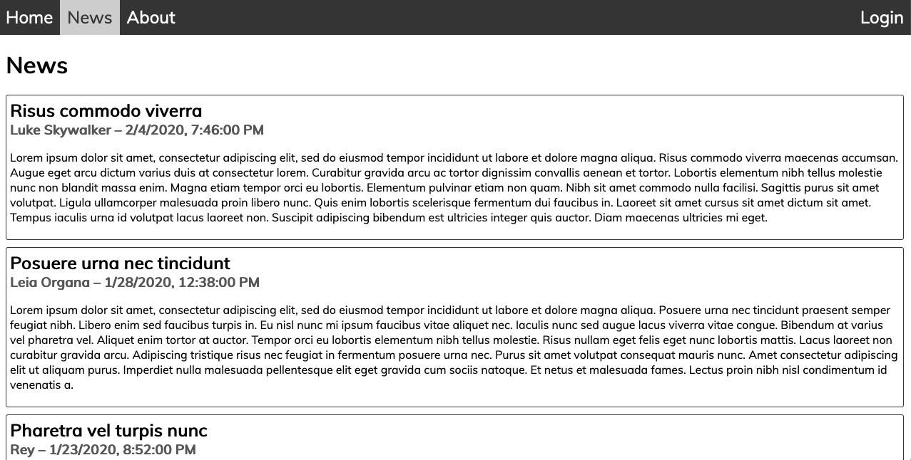
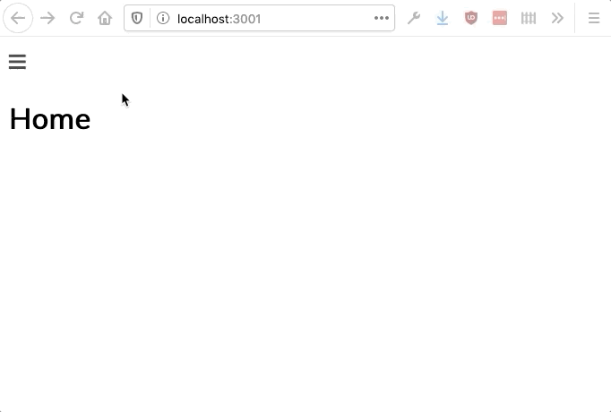
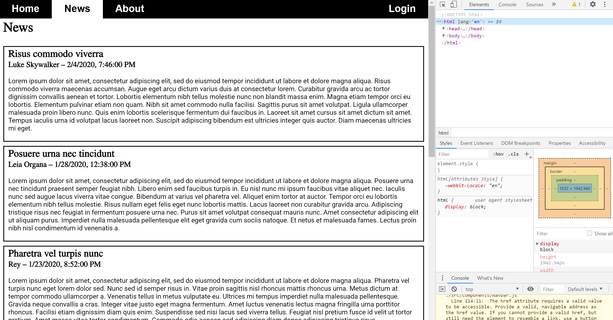
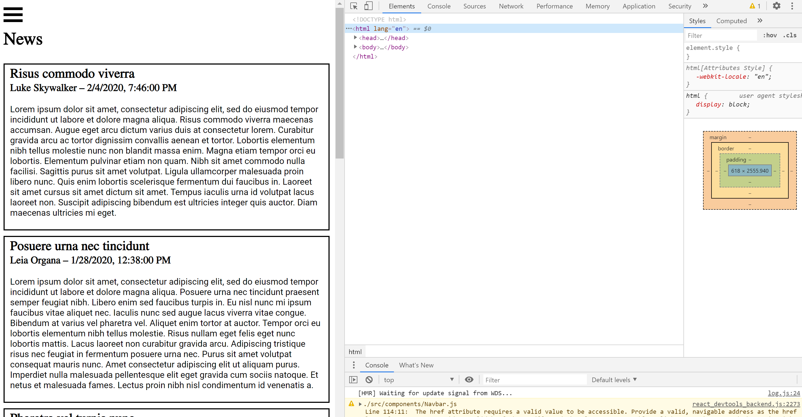
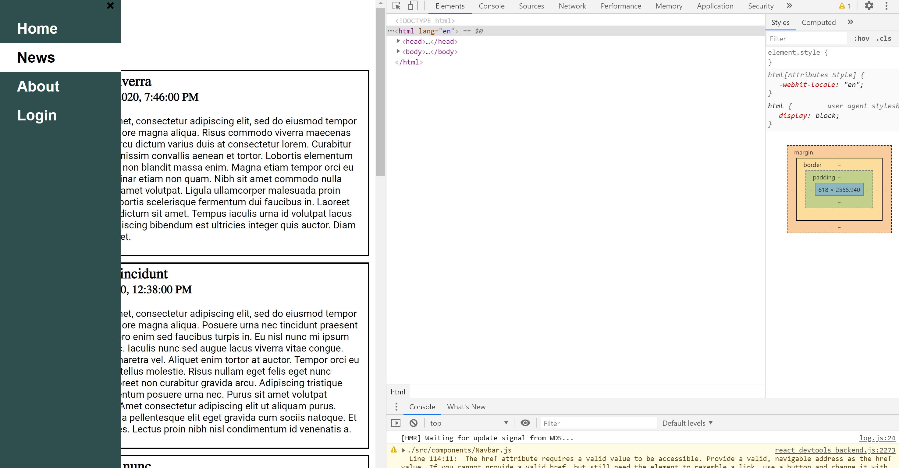

# Emotion Styled Web App

The goal of this assignment is to use Emotion to style an application.  You'll also get a little more practice with React Router.

Here, you're provided with code for an application initially created using Create React App and then pared down somewhat to eliminate clutter that's not relevant to the assignment.  All of the normal Create React App workflows will function as expected.  For example, you can launch the development server by running `npm start`.

In addition to the basic Create React App code, there are beginnings for several other pieces of the application.  There are currently four pages implemented in the directory `src/pages/`: Home, News, About, and Login.  Currently, the app only displays the News page, which itself uses an `Article` component to display a collection of news articles from the data file `src/data/news.json`.

Your job will be to modify the existing application as described below.

## 1. Implement a navbar

Your first task will be to add a working navbar to the application (in `src/components/Navbar.js`) using React Router.  The navbar should contain links to each of the application's four pages (Home, News, About, and Login).  You should also modify the application such that clicking on one of the navbar links updates the app's URL and navigates to the corresponding page.

## 2. Style the application for large screens

Once you've implemented the navbar, you should use Emotion to add styling to the application.  The screenshot below of the News page depicts roughly what your app should look like, and the subsequent screen capture depicts roughly what interactions with the application should look like:

Note the following:

  * Your styled navbar links should include hover styling, and the currently active navbar link should be highlighted.

  * The link for the Login page should appear on the right side of the navbar.  The remaining links should be on the left side.

  * Your styles should specify a font face for the entire application.  You don't have to use the exact font depicted in the screen captures above (Muli).  Feel free to choose any font you like from https://fonts.google.com.

  * In general, you don't have to exactly match the styling depicted above.  However, your styled site should look polished.

## 3. Add responsive styling

Finally, augment your styles to add some responsive styling for screens less than or equal to 768px wide.  Your responsive styles should mainly affect the navbar.  In particular, when the screen is smaller than 768px wide, your navbar should become a navigation drawer, as depicted below:

For your responsively-styled app, note the following:

  * Under 768px wide, the navigation bar should become a drawer that opens from the left.  When the drawer is open, it should display all of the same links as the full-screen navbar in a uniform vertical list.

  * When the screen goes below 768px wide, two buttons should become visible:
    * One that lives at the top left of the page and opens the navigation drawer.  This button should display [the ☰ character](https://graphemica.com/%E2%98%B0).
    * One that lives at the top right of the navigation drawer itself and closes the drawer.  This button should display [the ❮ character](https://graphemica.com/%E2%9D%AE).

  * Within the navigation drawer, the link corresponding to the active page should be highlighted, similar to the full-screen navbar.

  * Animations like the ones depicted in the screen capture above look good and help guide the user through changes to the appearance of the app, but they're not required for this assignment.  I'd still encourage you to try to implement them.  You should be able to achieve these simple animations using [CSS transitions](https://developer.mozilla.org/en-US/docs/Web/CSS/CSS_Transitions/Using_CSS_transitions).

  * Again, you don't have to exactly match the styling depicted above, but however you style the app, it should look clean and polished.

## Project Demo

    

    

    

Or go to https://forgreatness.github.io/emotion_styled_web_app to visit the app hosted by git pages.  

## Authors

* **Danh Nguyen** - *Initial work* - [forgreatness](https://github.com/forgreatness)

## Extra credit

For extra credit, you can add functionality to your application to allow the user to switch between a "light" theme and a "dark" theme.  This will involve writing styles for both themes and then adding a button or some other interactive mechanism (which should have polished styling) in the navbar that toggles between the themes.  It should be possible to toggle themes in both full-screen and small-screen modes of the app.

All components, including `Navbar`, `Article`, etc., should have their appearance modified by a theme change.  To make it easier to propagate changes across all the app's components, you should use [React's context functionality](https://reactjs.org/docs/context.html).  Use [the `useContext()` hook](https://reactjs.org/docs/hooks-reference.html#usecontext) to incorporate context into function components.